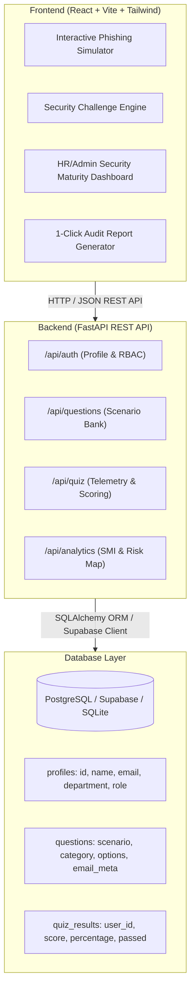

# SecureMind: Staff Security Awareness Platform

[](https://3mtt.nitda.gov.ng/)
[](#technical-stack)
[](#security-architecture)

---

## 1. Executive Summary & Problem Statement

Human error represents over **74% of enterprise cybersecurity breaches** (Verizon DBIR). Traditional corporate compliance training relies on monotonous annual slide decks that fail to build instinctive defensive habits.

**SecureMind** transforms corporate cybersecurity education into an active, gamified simulation platform. By combining realistic **email header/domain inspection ("Spot the Lie")**, multi-category **scenario-based challenges**, instant **educational feedback loops**, and an executive **Security Maturity Index (SMI) Dashboard**, SecureMind empowers staff to detect threats before damage occurs.

> Developed as a capstone submission for the **3 Million Technical Talent (3MTT)** program.

---

## 2. Technical Stack

| Tier | Technologies |
| :--- | :--- |
| **Frontend** | React 18, Vite, Tailwind CSS, Lucide React, Framer Motion, Recharts, Canvas-Confetti, jsPDF, html2canvas |
| **Backend** | Python 3.11+, FastAPI, SQLAlchemy ORM, Pydantic v2, Uvicorn |
| **Database** | Supabase (PostgreSQL) with SQLite zero-configuration local fallback |
| **Testing** | Pytest, FastTest HTTP Client, Vite build validation |
| **Deployment** | Vercel (Frontend SPA) & Render / Railway (Backend API) |

---

## 3. Architecture & Data Schema



---

## 4. Key Feature Modules

### A. Phishing Inspection Lab ("Spot the Lie")
- **Header Inspection:** Analyze SPF, DKIM, and technical routing indicators.
- **Link Target Detection:** Real-time hover inspection exposes typosquatted domain lookalikes (e.g. `securem1nd-corp.com` vs `securemind-corp.com`).
- **Interactive Red Flag Discovery:** Click and tag indicators of compromise before deciding to "Report Phishing" or "Mark Safe".
- **Instant Debrief Loop:** Explains threat mechanics, psychological triggers, and mandatory enterprise protocols.

### B. Gamified Scenario Knowledge Engine
- Multi-domain threats: **CEO Fraud / BEC**, **MFA Fatigue / Prompt Bombing**, **Vishing & AI Voice Clones**, **USB Drop & Baiting**, and **Macro Ransomware**.
- Instant remediation guidance on every choice submission.
- Real-time score recording linked to employee department.

### C. HR & Admin Security Maturity Dashboard
- **Security Maturity Index (SMI):** 0–100% executive health score.
- **Department Vulnerability Heatmap:** Benchmarks risk across Finance, HR, Engineering, Sales, Legal, Operations, and Executive teams.
- **Threat Category Radar:** Pinpoints organizational weaknesses.
- **1-Click Executive PDF Report:** Exports a professional compliance audit report.
- **Scenario Curriculum Manager:** Add and publish custom organizational threat simulations.

---

## 5. Quickstart & Local Installation

### Prerequisites
- Node.js (v18+ recommended)
- Python (v3.10+ recommended)

### Step 1: Start Backend (FastAPI)
```bash
cd backend
# Create virtual environment
python -m venv .venv

# Activate environment (Windows)
.\.venv\Scripts\activate
# (Linux/macOS)
# source .venv/bin/activate

# Install dependencies
pip install -r requirements.txt

# Run FastAPI backend with hot-reload (Port 8000)
uvicorn app.main:app --reload --port 8000
```
*API docs available at: `http://localhost:8000/docs`*

### Step 2: Start Frontend (React + Vite)
```bash
cd frontend
# Install dependencies
npm install

# Start development server (Port 3000)
npm run dev
```
*Platform available at: `http://localhost:3000`*

---

## 6. Cloud Deployment Guide

### Deploying Frontend to Vercel
1. Push repository to GitHub.
2. In Vercel, import the repository and set the **Root Directory** to `frontend`.
3. Build Command: `npm run build`
4. Output Directory: `dist`
5. Add Environment Variable:
   - `VITE_API_URL`: `https://your-backend-render-app.onrender.com/api`

### Deploying Backend to Render
1. Create a new **Web Service** on Render pointing to your repository.
2. Set **Root Directory** to `backend`.
3. Environment: `Python 3`
4. Build Command: `pip install -r requirements.txt`
5. Start Command: `uvicorn app.main:app --host 0.0.0.0 --port $PORT`
6. (Optional) Set `DATABASE_URL` to your Supabase PostgreSQL connection string.

---

## 7. License & Attribution
Developed for the **3 Million Technical Talent (3MTT) Program Capstone Submission**.  
MIT License.
